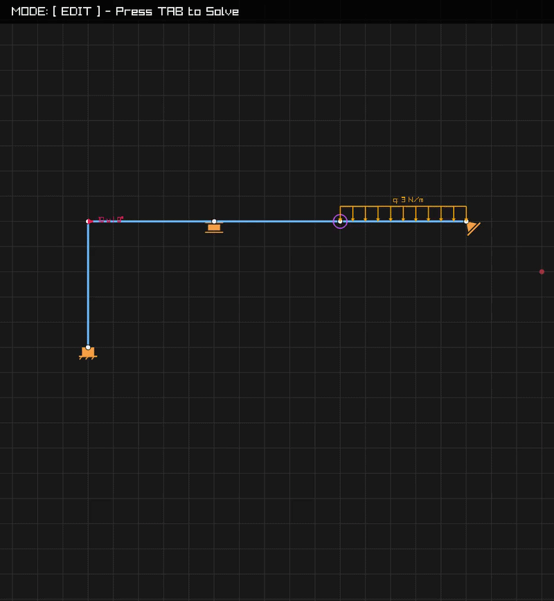

# Harmonia - FEM Engine

A powerful, interactive 2D structural frame analyzer based on the Finite Element Method (FEM). Developed in C using the Raylib graphics library, it allows you to draw structures, apply constraints and loads, and calculate reaction forces and internal stress diagrams in real-time.



## Key Features

* Interactive Modeling: Draw nodes and beams on a magnetic grid using a fluid interface.
* Slanted Support Support: Exact calculation for rotated constraints using local coordinate transformation matrices.
* Constraint Variety:
    * External: Free, Pinned, Roller, Slider, Sleeve (Double Pendulum), Fixed.
    * Internal: Internal hinges and releases for non-rigid joints.
* Complex Loading:
    * Concentrated nodal forces with variable angles.
    * Distributed beam loads (both axial and perpendicular).
* Robust FEM Solver: Matrix implementation with 3 Degrees of Freedom (DOF) per node.
* Visual Post-Processing:
    * Reaction Forces and Moments.
    * Normal Force Diagram (N).
    * Shear Force Diagram (T).
    * Bending Moment Diagram (M) with parabolic curves for distributed loads.

## Prerequisites

* C11 Compiler (GCC, Clang, or MSVC).
* CMake (version 3.14 or higher).
* Raylib: No manual installation required, it is fetched automatically via FetchContent in CMakeLists.txt.

## Build and Run

```bash
# 1. Create a build directory
mkdir build
cd build

# 2. Configure and Compile
CMAKE_POLICY_VERSION_MINIMUM=3.5 cmake ..
cmake --build .

# 3. Run the executable
./Harmonia
```

## Controls and Usage

### EDIT Mode (Construction)
* `Right Click`: 
    * Click on empty space: Create a Node.
    * Drag between nodes: Create a Beam.
* `Left Click` (on Node): Cycle through external constraints.
* `Shift` + `Left Click` (on Node): Cycle through internal releases.
* `Mouse Wheel` (on Node): Rotate the constraint.
* `F` Key + `Drag` (on Node): Apply and aim a concentrated force.
* `F` Key + `Arrow Keys` (on Beam): Apply a distributed load.
* `C` Key: Cleans the whole scene.

### Results Visualization
* `TAB` Key: Toggle through visualization modes (EDIT -> REACTIONS -> N -> T -> M).
* `Up/Down Arrows`: Visually scale the size of diagrams and reaction arrows.